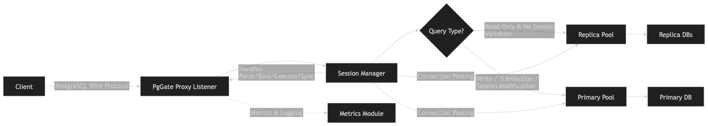

# PgGate: A High-Performance PostgreSQL Proxy

  

  
  
  

---

## Technical Overview

PgGate is a specialized, protocol-aware TCP proxy designed specifically for PostgreSQL database clusters. It serves as an intermediary layer between application services and database nodes, providing intelligent traffic orchestration, connection management, and session state preservation.

Unlike general-purpose load balancers, PgGate operates with a deep understanding of the PostgreSQL wire protocol. This allows it to perform real-time query inspection and implement sophisticated routing strategies, such as read/write splitting, while ensuring semantic consistency for the connecting client.

## Core Capabilities

- **Intelligent Query Dispatch**: Automatically routes write operations (INSERT, UPDATE, DELETE) and DDL to the primary node, while dispatching read-only queries (SELECT) to available replicas.
- **Advanced Connection Pooling**: Implements efficient connection management for both primary and replica nodes, reducing overhead and improving backend resource utilization.
- **Extended Protocol Compliance**: Provides comprehensive support for both Simple and Extended Query protocols, enabling compatibility with prepared statements and advanced ORM features.
- **Session State Persistence**: Automatically detects session-modifying commands (e.g., SET, RESET) and pins the client session to the primary node to prevent state divergence or inconsistent behavior across replicas.
- **Integrated Observability**: Exposes a Prometheus-compatible metrics endpoint for real-time monitoring of connection rates, query latency, and node health.
- **Dynamic Configuration**: Supports zero-downtime configuration reloads via the SIGHUP signal, allowing for operational adjustments without disrupting active client sessions.
- **Fault Tolerance**: Implements configurable retry logic for transient backend connection failures, enhancing the overall reliability of the database access layer.

## System Architecture

The PgGate architecture is modular and highly concurrent, leveraging Go's efficient threading model:

- **Listener Layer**: Manages incoming TCP traffic, handles connection limiting, and manages the initial handshake process.
- **Session Manager**: The central component responsible for protocol parsing, message routing, and maintaining the lifecycle of individual client connections.
- **Routing Engine**: Employs an extensible heuristic parser to analyze SQL statements and determine the optimal backend destination.
- **Pool Management**: Orchestrates multiple connection pools across the cluster, implementing load balancing and health checks for replica nodes.

## System Workflow

The following diagram illustrates the lifecycle of a client connection and the decision-making process within PgGate:

  

1.  **Connection Establishment**: The client initiates a TCP connection to the PgGate Listener.
2.  **Protocol Handshake**: PgGate handles the initial Postgres handshake, including SSL negotiation and StartupMessage processing.
3.  **Authentication Proxying**: The proxy facilitates the authentication exchange between the client and the primary Postgres node.
4.  **Message Inspection**: Once authenticated, PgGate enters a loop to intercept frontend messages (Simple or Extended).
5.  **Routing Decision**:
    -   If a message contains a query, the **Router** analyzes the SQL command.
    -   State-modifying commands or queries within an open transaction are pinned to the **Primary**.
    -   Non-transactional read-only queries are dispatched to a **Replica**.
6.  **Backend Execution**: PgGate acquires a connection from the appropriate pool, forwards the message, and streams the backend response back to the client.
7.  **Resource Return**: Upon session termination or transaction completion (for replicas), backend connections are returned to the pool for reuse.

## PostgreSQL Wire Protocol Implementation

PgGate implements the PostgreSQL Frontend/Backend Protocol (Version 3.0) with a focus on transparency and performance.

### Handshake and Security
The proxy intercepts the initial connection request and manages the `SSLRequest` negotiation. It transparently proxies the authentication exchange between the client and the primary backend, supporting standard password-based authentication mechanisms (Cleartext, MD5, and SCRAM) without direct credential management.

### Simple Query Processing
For Simple Query ('Q') messages, the proxy:
1.  Parses the SQL command.
2.  Consults the Routing Engine to identify the appropriate backend (Primary or Replica).
3.  Acquires a connection from the corresponding pool.
4.  Forwards the message and streams the results back to the client.

### Extended Query Workflow
PgGate provides robust handling for the multi-message Extended Query protocol:
- **Parse**: The query is extracted from the 'P' message to determine the routing destination. This destination is then locked for the remainder of the extended protocol sequence.
- **Bind, Describe, and Execute**: These messages are strictly forwarded to the backend connection established during the Parse phase to maintain internal statement state.
- **Sync and Flush**: The proxy facilitates the completion of the execution sequence and manages the return of the result set to the client.

### Transaction and State Management
Semantic correctness is maintained through precise state tracking:
- **Transaction Blocks**: Detection of `BEGIN` blocks ensures that all subsequent operations within the transaction are atomically routed to the primary node.
- **Session Variables**: Detection of session-modifying commands (e.g., `SET search_path`) triggers "session pinning," where the client is pinned to the primary node for the lifetime of the session to ensure global state consistency.

## Monitoring and Observability

PgGate exposes a monitoring endpoint (default port 8080) providing standard metrics:
- Active and total client connections.
- Query distribution metrics (Primary vs. Replica routing).
- Error rates and backend health statistics.

---

*PgGate: Reliable, protocol-aware database orchestration.*
